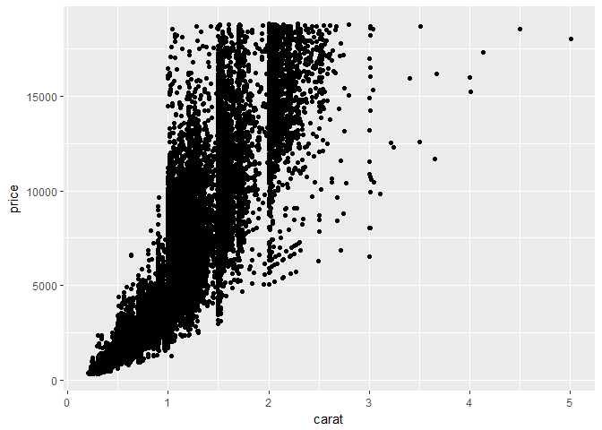

Sandbox
================
Ellis Hughes

[](https://travis-ci.org/thebioengineer/sandbox)
[](https://ci.appveyor.com/project/thebioengineer/sandbox)
[](https://codecov.io/gh/thebioengineer/sandbox)

Sandbox is intended to provide a solution for reproducible research by reducing the potential for interference of a dirty environment. This is done by executing either your scripts or your provided code in a completely separate r-session.

## Installation


Currently this package is only available on GitHub:
``` r
devtools::install_github("thebioengineer/sandbox")
```

## Usage


### Capture Ouputs

The basic use of sandbox would be to wrap your current code in the sandbox function, as below. That's it!

``` r

library(sandbox)
sandbox({
  suppressPackageStartupMessages({
  library(tidyverse)
  })
  
  attach(diamonds)
  
  ggplot(diamonds, aes(x=carat, y=price)) + geom_point()
  
  diamonds%>%
    mutate(carat_binned=cut(carat, c(0,.5,.9,1,1.5,1.9,2,2.5,3,4,5,6)))%>%
    group_by(carat_binned,cut)%>%
    summarize(avgPrice=mean(price))%>%
    spread(cut,avgPrice)
  
})
```

By executing the code, it will return the plot generated by ggplot, and the output of the summarization of the `diamonds` dataset into your console. Your environment will remain clean, and none of the tidyverse packages will be loaded into your namespace on your current machine:




    ## # A tibble: 11 x 6
    ##    carat_binned   Fair   Good `Very Good` Premium  Ideal
    ##    <fct>         <dbl>  <dbl>       <dbl>   <dbl>  <dbl>
    ##  1 (0,0.5]       1028.   786.        766.    863.   864.
    ##  2 (0.5,0.9]     2297.  2520.       2548.   2387.  2425.
    ##  3 (0.9,1]       3715.  4586.       4922.   4698.  4861.
    ##  4 (1,1.5]       5003.  5897.       6502.   6260.  7055.
    ##  5 (1.5,1.9]     7899.  9810.      11066.  11039. 11741.
    ##  6 (1.9,2]      11551. 14393.      14903.  14062. 14667.
    ##  7 (2,2.5]      11524. 14483.      15135.  14946. 15568.
    ##  8 (2.5,3]      13212. 15402.      15036.  15987. 16333 
    ##  9 (3,4]        13611  18359       15669   14914. 14427.
    ## 10 (4,5]        17930     NA          NA   15223     NA 
    ## 11 (5,6]        18018     NA          NA      NA     NA


``` r
ls()
```

    ## character(0)

``` r
"tidyverse"%in%loadedNamespaces()
```

    ## [1] FALSE


### Returning Ouputs

In situations where you may want return the outputs of the processing, you can 'leak' objects out of the sandbox environment into your global environment. This time, we are not plotting so there will be no output. However, when we `ls()` the current R session, summarizedDiamonds now exists.

``` r

library(sandbox)
sandbox({
  suppressPackageStartupMessages({
  library(tidyverse)
  })
  
  attach(diamonds)
  
  summarizedDiamonds<-diamonds%>%
    mutate(carat_binned=cut(carat, c(0,.5,.9,1,1.5,1.9,2,2.5,3,4,5,6)))%>%
    group_by(carat_binned,cut)%>%
    summarize(avgPrice=mean(price))%>%
    spread(cut,avgPrice)
    
  leak(summarizedDiamonds)
  
})

ls()
```

    ## [1] "summarizedDiamonds"

## Other Packages

While other packages, such as [callr](https://github.com/r-lib/callr), also provide similar abilities, sandbox as the unique benefit of returning all the outputs of your code - print outs, plots, even objects -  not just one output. Also, sandbox does not require using anonymous functions to pass complex workflows.