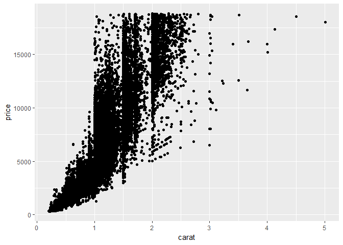

sandbox R
================
Ellis Hughes

[](https://travis-ci.org/thebioengineer/sandbox) [](https://codecov.io/gh/thebioengineer/sandbox) [](https://ci.appveyor.com/project/thebioengineer/sandbox)

This is an example of running your code within a sandbox. write your code as normal, but wrap it within a "sandbox" function. Your code will now be evaluated within its own R session, and outputs will be returned to your console.

``` r
library(sandbox)
```

    ## Loading required package: evaluate

    ## Loading required package: stringi

``` r
sandbox({
  suppressPackageStartupMessages({
  library(tidyverse)
  })
  
  attach(diamonds)
  
  ggplot(diamonds, aes(x=carat, y=price)) + geom_point()
  
  diamonds%>%
    mutate(carat_binned=cut(carat, c(0,.5,.9,1,1.5,1.9,2,2.5,3,4,5,6)))%>%
    group_by(carat_binned,cut)%>%
    summarize(avgPrice=mean(price))%>%
    spread(cut,avgPrice)
  
})
```



    ## # A tibble: 11 x 6
    ##    carat_binned   Fair   Good `Very Good` Premium  Ideal
    ##    <fct>         <dbl>  <dbl>       <dbl>   <dbl>  <dbl>
    ##  1 (0,0.5]       1028.   786.        766.    863.   864.
    ##  2 (0.5,0.9]     2297.  2520.       2548.   2387.  2425.
    ##  3 (0.9,1]       3715.  4586.       4922.   4698.  4861.
    ##  4 (1,1.5]       5003.  5897.       6502.   6260.  7055.
    ##  5 (1.5,1.9]     7899.  9810.      11066.  11039. 11741.
    ##  6 (1.9,2]      11551. 14393.      14903.  14062. 14667.
    ##  7 (2,2.5]      11524. 14483.      15135.  14946. 15568.
    ##  8 (2.5,3]      13212. 15402.      15036.  15987. 16333 
    ##  9 (3,4]        13611  18359       15669   14914. 14427.
    ## 10 (4,5]        17930     NA          NA   15223     NA 
    ## 11 (5,6]        18018     NA          NA      NA     NA

This may seem pointless, but now the output and dirtyness that results from loading large/competing libraries into your environment are contained into small sections of your code, and cannot interfere with other chunks.

``` r
ls()
```

    ## character(0)

``` r
"tidyverse"%in%loadedNamespaces()
```

    ## [1] FALSE

Leaking
-------

You can also now 'leak' objects out of the sandbox environment into your own. This may be useful if you only want the side effects of running or the end result of an analysis that may be dirty if multiple libraries are used. For example, if you had your own version of a function, you can safely run your code in the sandbox and still expect a save environment outside.

``` r
sandbox({

  #weird function overwriting a normally used function. In this case, transposing a data.frame
  data.frame<-function(...){
    base::data.frame(t(base::data.frame(...)))
  }

  transposedDataFrame<-data.frame(c(1,2,3),c(4,5,6))
  
  leak(transposedDataFrame)
})
```

The result is that now 'transposedDataFrame' is in the environment for access, and we still have a normal data.frame function!

``` r
transposedDataFrame
```

    ##            X1 X2 X3
    ## c.1..2..3.  1  2  3
    ## c.4..5..6.  4  5  6

``` r
head(data.frame)
```

    ##                                                                              
    ## 1 function (..., row.names = NULL, check.rows = FALSE, check.names = TRUE,   
    ## 2     fix.empty.names = TRUE, stringsAsFactors = default.stringsAsFactors()) 
    ## 3 {                                                                          
    ## 4     data.row.names <- if (check.rows && is.null(row.names))                
    ## 5         function(current, new, i) {                                        
    ## 6             if (is.character(current))

This is just the beginning, with future work to allow the import of specific objects to the sandbox session, logging, etc
